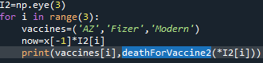

<!DOCTYPE html>
<html>
    <head>
        <meta charset="utf-8">
    </head>
    <body>
        <!--맨 처음 인트로-->
        

        <h1>프로젝트 개요</h1>
            이번 프로젝트에서 제가 만들어볼 것은 머신 러닝을 이용한 현 코로나 상황 분석과 예측입니다.
             첫 번째로 살펴볼 것은 확진자수의 증가 추이와 증가 추이를 직관적으로 제가 직접 해석하여 line pitting을 해보는 것과, 증가 추이를 머신 러닝을
            통하여 예측하는 것입니다. 제가 계획했던 당시는 기말 과제에 대한 공지가 떴을 바로 직후라서 그때는 강력한 사회적 거리두기를 하고있었고 11월 말쯤에서 거리두기를
            완화하며 단계적 일상회복을 실시하며 확진자수가 폭발적으로 늘어갔습니다. 이에 상황이 바뀌었다고 판단하여, 사회적 거리두기를 계속 시행했다고 가정을 했을 때의 현재의
            확진자 수 예측과, 지금 단계적 일상회복을 시행하는 추이로써의 현재 확진자 예측을 해보겠습니다.  
             두 번째로 진행한 것은 백신과 사망률의 관계성입니다. 일단 백신이 바이러스 전파에는 거의 효과가 없다고 하며, 백신은 오로지 증상 완화에 효과가 있다고합니다.
            그로 인해서 저는 백신과 확진자수 증가와 억제 추이는 살펴보지 않을 것이며, 백신과 사망률과의 관계만 확인하고 그에 대한 결과를 분석해 볼 것입니다.  또한 현재
            한국에서 접종중인 백신은 아스트라제네카, 화이자, 얀센, 모더나 등 4가지가 있으며 하루하루 전체 접종수 안에 백신별로 접종 비율이 하루하루 달라지기 때문에 
            머신러닝으로 이 요소들의 영향 비율을 달리하여 추출할 수 있다고 생각하여 백신별 영향 비율 (계수)을 구하고 만약 백신별로 전국 모든 접종자가 한 가지 종류의
            백신을 맞았더라면 그에대한 사망률이 어떻게 달라지는 지와 그 결과를 이용하여 어느 백신이 가장 치명률을 줄일 수 있는 지에 대해서 분석해볼 예정입니다.
            <h3>사용한 오픈소스</h3>
        사용한 라이브러리로는 numpy, matplotlib, pandas, scipy, statsmdoels 등이 있으며, 오픈소스 강의자료와 수업내용, 그리고 위 오픈소스들의 userguide의 함수조작법만 참고하였습니다.  
        

        <!--nav-->
        <nav>
        <h3>목차</h3>
            <ul>
                <li href=#data>데이터 가공 과정</li>
                <li id=#linepitting>라인피팅과 머신러닝으로 예측하는 확진자 수</li>
                <li id=#deathRate>사망률 추이</li>
                <li id=#deathRateByVaccine>백신과 사망률의 관계</li>
            </ul>
        </nav>
        <h1 id="data">데이터 가공 과정</h1>
        

         
         
         
         맨처음 질병관리청에서 받은 파일 형식을 엑셀파일시트였으며, 불필요한 헤더가 있어서 필요한 셀들만 복사해 vi로 txt 파일로 옮기고, 클래스를 따로 만들어 문자열을 숫자로 바꾸고 ,과 같은 필요없는 문자를
         제거하여 행렬형태로 변환하였습니다..  
         
        

        
 
        

        <h1 id="linepitting">현재 확진자 추이</h1>
        

         
        현재 확진자에 대한 분포를 나타내었습니다. 중간 중간에 색이 다른 점들은 일정 기간 내에 피크 포인트를 나타낸 것이며 위드코로나 이전 피크 포인트만 나타내었습니다. 여기서 위드코로나 전 후로 확진자 증가 양상이 달라져 전후로 따로 분석해야겠다고 생각했습니다.
        

        <h1>라인 피팅과 머신러닝으로 예측하는 확진자 수</h1>
        

         
        파란색으로 보이는 점들은 위드 코로나 전 실제 확진자수를 나타낸 것이고, 노란색 점들은 위드코로나 이후
        확진자 수의 분포입니다.  검은색 선은 np라이브러리의 poly_fit 함수를 사용하여 라인피팅을
        한 것입니다. 위드코로나 이전까지의 데이터로 피팅을 하였으며 선형으로는 맞지 않아 7차 다항식으로 피팅을 하였습니다. 
         그리고 노란색으로 된 선은 위드 코로나 이후의 데이터로 피팅을 하였고, 분포가 단순하여 1차로 피팅을
        했는데도 실제 데이터 분포와 매우 일치하는 것을 볼 수 있습니다. 
         위드코로나 이전의 데이터들로 라인피팅을 한 그래프(빨간색과 검은색)들로 예측을 한 결과 위드코로나가
        시행되지 않았다면 확진자수가 계속 폭증하지는 않고 어느정도는 다시 감소했다가, 다시 증가하였을 것으로
        예측됩니다.
        빨간색 라인은 제가 직접 분포를 보고서 선형결합으로 어느정도 표현할 수 있겠다
        라고 생각하고 직접 구성한 라인피팅이며, 일단 확진자수가 진동형태로 증가하며, 주기가 2배가 되며,
        진동을 하더라도 지역적인 평균 확진자수는 늘고 있어서 아래와 같은 함수로 작성했습니다. 
        
        여기서 y는 그 날의 확진자 수이며, x는 코로나가 처음 등장하여 정부에서 관리하기 시작한 날로부터 경과일입니다. 나날이 평균 확진자는 늘어가기때문에 1차항과 상수항을 사용하였고, 진동을 표현하기 위해서 sine wave를 사용하였습니다. 여기서 계수 a,b,c를 구하기 위해서 수업시간에 배웠던 역행렬을
        사용하였습니다. 
         
        np 라이브러리에 있는 pinv 함수와 matmul을 이용하여 a,b,c를 구하였습니다. 하지만 실제 확진자 분포가 
        완전한 규칙을 가지고 있지 않아 선형결합의 해가 현실을 완벽하게 구하지는 않아서, 계수를 따로 보정해 
        주었습니다. 
         
        계수를 보정한 라인피팅 함수 여기서 liss는 선형결합의 해를 담은 배열을 뜻합니다. 
         
        선형결합의 해를 구한 배열 
        

        <h1 id="deathRate">사망률 추이 </h1>
        

        <h3>백신접종과 바이러스전파</h3>
         
         
         
         먼저 '정말 백신과 확진 사이에 관계가 없을까?'라는 생각을 하였고, 이는 회귀로 검증을 하기에는 여러 측정할 수 없는 외부 변수들이 많다고 생각하여 시각화정도로만 확인해 보았습니다. 날이 지남에 따라 확진자가 늘어나며,
         백신 접종률에 따른 확진자 수를 확인하기 위해서, 경과일, 백신 접종률, 확진자 수를 변수로  하여 3차원 시각화를 진행하였고, 경과일 변수를 뺀 2차원 시각화 자료로도 확인해 본 결과 백신 접종률과 확진자수 증가 추세는 딱히 인과관계가 없어보였습니다.
        

        

        <h3>백신 접종과 사망률</h3>
         
        전체 범위 내 사망률 추이를 가지고 왔습니다. 초반부에는 사망률이 아주 높습니다. 호흡기 감염 바이러스의 특성은 초반에 높은 사망률을 보이며, 후로 갈수록 바이러스가 변이가 되며 전염력이 높아지고 치명률은 감소한다는 정보와 일치하는 것을 볼 수 있습니다. 
        

        <h1 id="dataRateByVaccine">백신과 사망률</h1>
        
 
         
        <h5>백신 접종과 사망률</h5>
        백신 접종을 한 이후의 사망률을 확인해 보았습니다. 파란색으로 나타난 점들이 실제 사망률입니다. 사망률이 백신
        접종을 시작한 초반에는 크게 감소하며, 백신 접종률이 높아질수록 다시 사망률이 높아지는 것을 볼 수 있습니다.
        이는 백신 접종이 사망률 감소에 효과가 있긴 하나, 시간이 갈수록 백신에 의한 항체가 줄어들어, 효과가 다시 줄어드는 것을 볼 수 있습니다. 오른쪽과 같이 중반부에 한번에 확 끌어올린 백신접종률이, 그래프의 마지막 시점에
        다다라서 항체가 줄어든 인원들이 영향을 미친것으로 생각하면 사망률에 딱 들어맞습니다.
         
        <h5>사망률 분석</h5>
         먼저 보이는 빨간색 곡선은 poly_fit 함수를 사용하여 라인피팅을 한 것이며, 양쪽 끝에서 높은 값을 가지는 2차
         함수형태를 띄고 있습니다. 
         다음 보이는 초록색 직선은 statsmodes 오픈소스를 사용하여 구하였습니다. ols라는 함수를 이용하였는데 이는 
        최소제곱법(Ordinary Least Squares)을 사용하여 회귀직선의 계수를 구하는 함수입니다. 먼저 단순 '백신접종률'만을 변수로 취하여 넣어줬는데 그냥 평균 값을 구하는 정도로 의미있는 분석 결과를 내놓지 않았습니다. 
         그 다음 보이는 검은색 곡선은 백신별로 변수를 구분하여 아스트라제네카,얀센,모더나,화이자 네가지의 변수의
        계수를 ols함수를 사용하여 회귀분석한 결과입니다. 
         
        아스트라제네카,화이자,얀센,모더나 를 변수로 두고, ols에 넣고 결과를 확인하며 결과 계수는   AZ3:923e+04,
        Fizer:9.816e+04,Y:-2.431e+06,Modern:3.382e+05  로 나왔습니다. 이 계수들과 접종률을 곱한뒤 사망률이 나오기때문에 계수들을 해석을 해보면, 계수가 작을수록 백신의 효과가 좋다는 것입니다.  그런데 얀센은 1차 접종만 시행하며, 그로인해 항체 생성률이 가장 작은데, 데이터 분석 결과 사망률을 가장 많이 낮추는 백신으로 결과가 나왔습니다. 이를 생각해보면, 백신 접총 초기에는 백신 접종률이 아주 적었던 데에다가, 백신을 접종하면서 사망률이 크게 감소하는데, 얀센 백신이 초기에는 전체 백신 접종 중 많은 비율을 차지하고 있어서
        얀센의 계수가 초반의 데이터로만 학습이 되어 이런 결과가 나온 것 같습니다. 얀센을 제외하고는 모더나,아스트라제네카, 화이자 순으로 백신의 효과가 있다는 결과가 나왔으며, 이 변수들을 이용해 함수를 만들고, 검은색 곡선이 나왔습니다. 검은색 곡선의 함수는 최종적으로 아래와 같습니다.
         
         위의 결과를 보정하기 위해서 변수들을 조정하였습니다. 먼저, 백신 접종 후 3개월이 지나면 항체가 많이 없어진다는 정보를 이용하여 백신 접종후 90일이 경과한 인원들은 백신미접종과 같게 분류를 하고, 얀센은 최종적으로보면 전체 백신접종 중에 극소비율만 차지하므로 아스트라제네카,화이자,모더나만 변수로 추가하였습니다. 
          
          
         보정 후 결과 계수들을 분석해보면, 화이자,아스트라제네카,모더나 순으로 백신효과가 좋다고 나왔습니다. 이를
         피팅 해 본 결과가 아래 노란색 선이며, 검은색 선 보다 후반부에 실제 데이터와 더 근접한다고 볼 수 있습니다. 
          
         그 후 한 종류의 백신으로 전체백신접종률을 달성하게 된다면 사망률이 어떻게 될 것인지를 분석해보았습니다.
          
         이를 보듯이 아스트라제네카와 화이자 백신은 음의 값으로, 모두 이 백신들로만 구성했을 경우 사망률이 0에 가깝게 나올것이며, 모더나만 맞을을 시 사망률이 1퍼센트에 근접할 것으로 보입니다.
         <footer><h2>라이센스</h2>MIT</footer>
    

    </body>
</html>